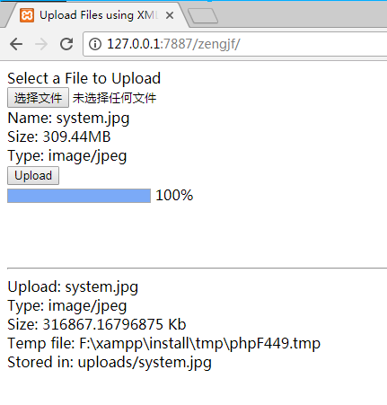

# HTML5 File Upload Example

在上传一些文件到Server的时候，能够自动的显示当前的上传的百分比，这个不会让等待的人感觉不知所措，Example后台采用PHP，都是原生的HTML、Javascript，没有使用其他的库，如果需要分析原理，应该是很好的Example。

所涉及到的文件，代码总共120行:smile:：
* [index.php](index.php)
* [upload.php](upload.php)

## 参考文档

[Html5 File Upload with Progress](http://www.matlus.com/html5-file-upload-with-progress/#codeListing3)

## 输出

